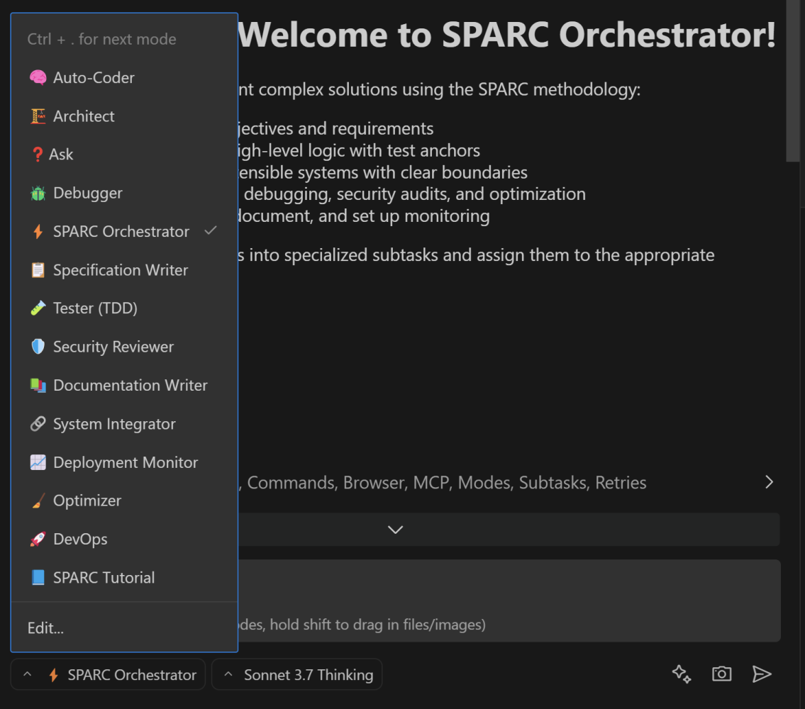

# roocode-modes
This repository integrates Roo Code with the innovative SPARC Orchestration framework, enabling efficient task delegation and modular project development. By leveraging the SPARC methodology (Specification, Pseudocode, Architecture, Refinement, Completion) and advanced reasoning models, it ensures secure, testable, and maintainable outputs across specialized modes like Debug, TDD, Security Reviewer, and more. With features like isolated contexts, iterative refinement, and seamless integration, this setup promotes best practices throughout the development lifecycle.

---
**Source:** https://www.linkedin.com/pulse/boomerang-tasks-automating-code-development-roo-sparc-reuven-cohen-nr3zc

---




## Installation
### Option 1: Using VS Code Interface
1. In VS Code, click the mode selection menu at the bottom-left corner (default Roo Code modes include *Code*, *Architect*, *Ask*, etc.).
2. Select **Edit**.
3. Click the `{ }` icon in the top-right corner of the `Modes` section.
4. Click the **Edit Project Modes** button.
5. Copy the content of the `.roomodes` file from this repository and paste it into the editor.
6. Save your changes and restart VS Code.

### Option 2: Manual File Copy
1. Copy the `.roomodes` file to your project directory.
2. Open your project directory in VS Code.

---

## Install as Global Configuration

### Option 1: Using VS Code Interface
1. In VS Code, click the mode selection menu at the bottom-left corner (default Roo Code modes include *Code*, *Architect*, *Ask*, etc.).
2. Select **Edit**.
3. Click the `{ }` icon in the top-right corner of the `Modes` section.
4. Click the **Edit Global Modes** button.
5. Copy the content of the `.roomodes` file from this repository and paste it into the editor.
6. Save your changes and restart VS Code.

### Option 2: Manual File Edit
1. Copy the content of the `.roomodes` file from this repository.
2. Paste it into Roo Code's global mode configuration file:
   **Default Path on Linux:**
   ```bash
    ~/.config/Code/User/globalStorage/rooveterinaryinc.roo-cline/settings/custom_modes.json
   ```
3. Save your changes and restart VS Code.


## Modes
### ⚡️ SPARC Orchestrator
**Role:** Breaks down large objectives into delegated subtasks aligned to the SPARC methodology.  
**Focus:** Secure, modular, testable, and maintainable delivery using advanced reasoning models.

---

### 📋 Specification & Pseudocode
**Role:** Captures the complete project context and produces a modular pseudocode blueprint with TDD anchors.  
**Focus:** Clear, modular design; externalizes configuration; splits complex logic across modules.

---

### 🏗️ Architect
**Role:** Designs scalable, secure, and modular architectures based on requirements and pseudocode.  
**Focus:** Detailed system diagrams, data flows, API boundaries, and service segmentation.

---

### 🧠 Code
**Role:** Implements robust, efficient code using externalized configurations.  
**Focus:** Clean, modular code split into files under 500 lines, with no hard-coded secrets.

---

### 🧪 TDD
**Role:** Enforces Test-Driven Development by writing failing tests first and then minimal code followed by refactoring.  
**Focus:** Thorough test coverage, modular test files, and adherence to security practices.

---

### 🪲 Debug
**Role:** Troubleshoots and resolves runtime issues using logging, tracing, and analysis tools.  
**Focus:** Isolates and fixes bugs while keeping fixes modular and secure.

---

### 🛡️ Security Reviewer
**Role:** Audits code and architecture to identify vulnerabilities and enforce secure practices.  
**Focus:** Detects exposed secrets, oversized files, and non-modular code, recommending necessary mitigations.

---

### 📚 Documentation Writer
**Role:** Produces clear, comprehensive Markdown documentation for usage, configuration, and integration.  
**Focus:** Modular documentation (files under 500 lines) that avoids exposing sensitive data.

---

### 🔗 Integrator
**Role:** Merges outputs from all specialized modes into a cohesive final product.  
**Focus:** Seamless integration of components ensuring modularity and adherence to security standards.

---

### 📈 Post-Deployment Monitor
**Role:** Monitors system performance post-deployment, collecting metrics, logs, and user feedback.  
**Focus:** Continuous monitoring with secure, modular configurations and prompt escalation of issues.

---

### 🧹 Optimizer
**Role:** Continuously refines and optimizes the codebase for performance, modularity, and maintainability.  
**Focus:** Refactoring, splitting large files, and externalizing configurations to meet best practices.

---

### ❓ Ask
**Role:** Guides users in formulating precise, modular requests to delegate tasks to the correct specialized modes.  
**Focus:** Providing task formulation and delegation strategies for effective inquiries.

---

### 🚀 DevOps
**Role:** Manages deployments and infrastructure operations across cloud providers, edge platforms, and internal environments.  
**Focus:** Secure, traceable, and automated deployments using CI/CD pipelines and managed configuration with no hard-coded credentials.

---

### 📘 SPARC Tutorial
**Role:** Guides new users through the SPARC development process using structured thinking models and clear task delegation with `new_task`.  
**Focus:** Educates on modular project setup, best practices (no hard-coded environment variables; files under 500 lines), and effective mode-to-mode handoffs with concise completions via `attempt_completion`.


## Implementation Instructions
### Activation
- **Activate SPARC Orchestrator:** In Roo Code, select "SPARC Orchestrator" as your primary mode.

---

### Task Delegation
- **Use `new_task`:** Delegate tasks to specialized modes such as Specification & Pseudocode, Architect, Code, TDD, Debug, Security Review, Documentation Writer, Integrator, Post-Deployment Monitor, Optimizer, Ask, and DevOps. Use the `new_task` command with clear instructions.  
- **Context Isolation:** Each subtask runs in its own isolated context and returns a concise summary via `attempt_completion`.  
- **Iterative Refinement:** Modes like TDD, Debug, and Security Reviewer iterate until:
  - All tests pass.
  - Files remain modular (under 500 lines).
  - No hard-coded environment variables exist.

---

### Final Integration & Monitoring
- **Integration Mode:** Consolidates outputs from all specialized modes into a final, cohesive deliverable.  
- **Documentation & Monitoring:**
  - Documentation Writer Mode produces detailed guides.
  - Post-Deployment Monitor tracks live performance and flags issues.  
- **Continuous Optimization:** The Refinement & Optimization mode ensures ongoing improvements and adherence to best practices.

---

### Customization Options
- **Tool Access Restrictions:** Adjust the `groups` field for each mode to control which tools they can access (e.g., read, edit, browser, command, mcp).  
- **Role Definitions & Custom Instructions:** Edit the `roleDefinition` and `customInstructions` fields to match your organization’s language and standards. For lengthy instructions, consider using `.clinerules-{mode-slug}` files.  
- **API Configuration (Optional):** Add an `apiConfiguration` property to any mode for model-specific parameters (e.g., `{"model": "gpt-4", "temperature": 0.2}`).  
- **Approval Settings:** Configure manual or auto-approvals for `new_task` and `attempt_completion` actions in your Roo Code workflow settings.  
- **Project-Specific Overrides:** Store a JSON file in `.roomodes` at your project root to override global settings from `cline_custom_modes.json`.